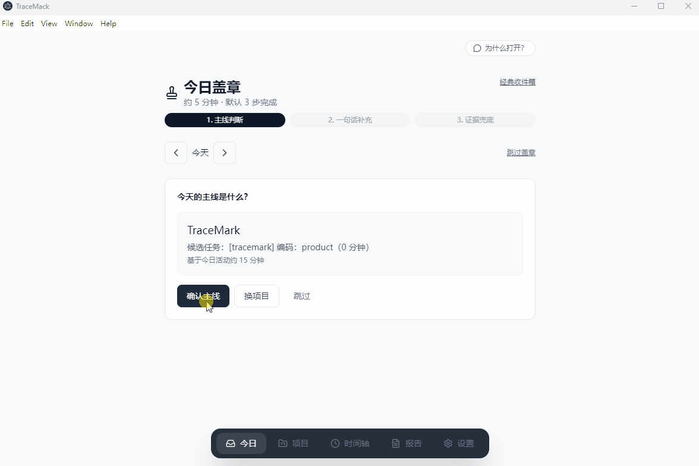

# TraceMark

[English](README.md) | **简体中文**

[](LICENSE)

TraceMark 是面向程序员的 **日报/周报代笔 + 上下文回忆机**（个人工作资产账本，开源 MIT）。本地采集前台活动与 Git 信号，经**今日盖章**与**资产确认**后，生成日报、本周战报与可分享的 **周记忆胶囊**；`Ctrl+K` 可搜索过去的工作资产与原始活动，并跳回时间轴定位。

> **不是**员工监控、团队工时或全量桌面记忆工具。数据默认留在本机；由你决定确认哪些内容、以及是否（以及在何种授权下）使用云端 AI。




**仓库地址：** https://github.com/lanlanxiaoxin/TraceMark

---

## 适用人群

| 优先 | 也适合 |
|------|--------|
| 程序员 | 实施工程师 |
| 产品经理 | 泛办公用户 |

---

## 60 秒上手

1. `npm run dev` 启动，在 **设置** 开启进程监听（Windows）。
2. **今日** 完成 **今日盖章**（三步：主线 → 一句话 → 证据兜底）。
3. **报告** 生成 **日报**；周五可收 **本周战报** 通知。
4. `Ctrl+K` 搜索关键词（如 `auth @last-week`）→ 打开时间轴定位。
5. **报告 → 本周战报** → **导出周记忆胶囊**（1080×1920 PNG，适合朋友圈/掘金）。

Demo GIF 录制说明见 [docs/demo/RECORDING.md](docs/demo/RECORDING.md)。

## 能做什么

```text
前台活动采集 → 脱敏解析 → 项目空间
  → 候选工作资产 + 今日盖章
  → 确认后进入资产库
  → 日报（盖章驱动）/ 本周战报 / 周记忆胶囊
  → Ctrl+K 回忆检索 → 时间轴高亮定位
```

### 主导航

| 入口 | 作用 |
|------|------|
| **今日** | 盖章流 + 资产收件箱（候选 → 已确认） |
| **项目** | 项目空间、资产库、复盘 |
| **时间轴** | 原始活动（按日浏览 + 回忆定位） |
| **报告** | 日报、本周战报、周记忆胶囊导出 |
| **设置** | 监听、隐私、AI、本地埋点看板 |

### 工作资产卡片类型

| 类型 | 说明 |
|------|------|
| **成果卡** | 已有明确交付或结果 |
| **过程卡** | 重要但尚未形成明确成果 |
| **证据卡** | 辅助材料，不能单独写成成果 |

未确认的卡片不会进入默认复盘；低置信度卡片会标记为待你补充确认。

---

## 隐私与信任

- **本地优先：** 活动与资产保存在本机 SQLite（位于系统用户数据目录）。
- **确认即可信：** 系统自动生成的仅为候选，未经你确认不会当作确定成果。
- **分级授权（L0–L3）：** 本地基础采集、云端结构化、增强摘要、按项目目录授权等，均有明确边界。
- **可选云端 AI：** 需自行配置 API Key 并同意；提供 AI 上传预览，可见即将发出的脱敏内容。
- **产品不做：** 团队管理后台、默认录屏/录音、全盘文档索引、上传原始完整窗口标题或可执行路径等。

---

## 平台支持

| 平台 | 状态 |
|------|------|
| **Windows** | 主平台，Win32 前台窗口采集 |
| **macOS / Linux** | ActivityProvider 抽象已预留，能力仍在完善 |

安装包将发布在 [GitHub Releases](https://github.com/lanlanxiaoxin/TraceMark/releases)。在此之前请从源码构建运行。

---

## 技术栈

- **桌面：** Electron 30（主进程 + 渲染进程）
- **界面：** React 18、TypeScript、Tailwind CSS 4
- **存储：** better-sqlite3（本地 SQLite）
- **构建：** electron-vite、electron-builder

---

## 快速开始

### 环境要求

- **Node.js** 18+（推荐 20 LTS）
- **npm** 9+
- **Windows**（完整活动采集；其他系统目前以开发/UI 为主）
- **Git**（可选，用于 Git 证据 enrichment）

### 克隆与开发运行

```bash
git clone https://github.com/lanlanxiaoxin/TraceMark.git
cd TraceMark
npm install
npm run dev
```

### 检查

```bash
npm run typecheck
npm run test
```

### 生产构建

```bash
npm run build
```

### 打包 Windows 安装程序（本地）

```bash
npm run package
```

产物在 `release/` 目录（已被 git 忽略，请勿把安装包提交进仓库）。

---

## 可选云端 AI

在 **设置** 中可配置兼容 OpenAI Chat Completions 的接口（`base_url`、`model`、`api_key`），用于候选资产生成与复盘。也可离线使用，此时候选卡片能力会相对简化。

切勿将 `.env` 或 API Key 提交到 Git；密钥仅保存在本机应用数据库中。

---

## 目录结构

```text
electron/          主进程：采集、数据库、IPC、AI 网关、生成器
src/               渲染进程：今日 / 项目 / 时间轴等页面
prompts/           报告与复盘提示词模板
build/             electron-builder 与安装程序配置
scripts/           开发、测试、打包脚本
```

开发约定见 [CLAUDE.md](CLAUDE.md)。


---

## 反馈与试用（v0.2.0）

- [发布说明](docs/RELEASE_NOTES_v0.2.0.md) · [English](docs/RELEASE_NOTES_v0.2.0.en.md) · [反馈指南](docs/FEEDBACK.md)
- Bug / 需求：[GitHub Issues](https://github.com/lanlanxiaoxin/TraceMark/issues)
- 讨论 / 试用：[GitHub Discussions](https://github.com/lanlanxiaoxin/TraceMark/discussions)

招募 **5 位**程序员试用 2 周，Issue 标题带 `[beta-trial]` 即可。

## 参与贡献

欢迎在 GitHub 提交 Issue 与 Pull Request。

1. Fork 后从 `main` 拉取功能分支（`feature/…` 或 `fix/…`）。
2. 改动尽量聚焦；提交前执行 `npm run typecheck` 与 `npm run test`。
3. 提交信息建议：`feat: …`、`fix: …`、`docs: …`（详见 [CLAUDE.md](CLAUDE.md)）。

---

## 许可证

[MIT](LICENSE) © lanlanxiaoxin

---

## 免责声明

TraceMark 会记录本机前台应用活动。请仅在本人有权使用的设备与账号上运行，并自行遵守当地法律与所在单位政策。
